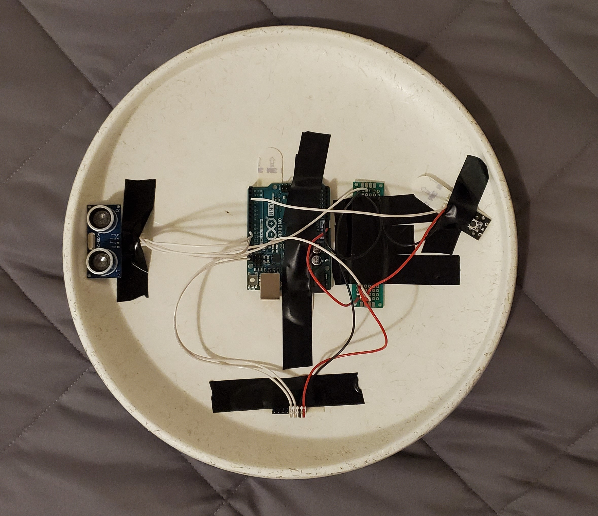

## The Synth Disc

The Synth Disc is a digital musical instrument that was created by Michael Ji for the course COMP_SCI_497/RTVF_376 Digital Musical Instrument Design at Northwestern University. Thanks to Stephan Moore and the rest of the 2021 class for all the help in making this instrument.

### Basic Description

The Synth Disc, as its name may imply, is a synthesiser-based instrument mounted on/inside a flying disc, better known as a Frisbee. The instrument controls 4 simple square wave oscillators, which can be cycled through by clicking a button. One tilt axis controls pitch; -90 to 90 degree tilt maps to about two octaves centered around middle C. The other tilt axis controls panning with full left to right range. Finally, there is an ultrasonic sensor that measures the distance to the ground, which controls the volume. Additionally, if the distance measured is less than 10cm, then a saw wave note at half frequency is played.

Disc Front: Looks like normal Frisbee
 

Disc Back: All sensors and Arduino

Sonically, it is relatively simple. The 4 osciallators will be set by instrument and then "left there" as the player cycles through. This allows the player to create interesting soundscapes, harmonize with themselves, and/or use oscillator as a melodic line while the others create a backdrop. The low note controlled by the ultrasonic sensor allows for a little articulation and rhythm to be added to the otherwise constant sound.

### Inspiration, Development, and Future Ideas

The instrument was inspired and developed from the physical interface, the Frisbee. I latched onto that as a basic early on, and from there chose sensors, control mechanics, and eventually the sound design based on the form of the Frisbee. Tilting the disc is a pretty intuitive control scheme, but I also originally wanted to incorporate spinning (and possibly throwing). However, being limited by a wired Arduino and a short time of development, I settled on tilt and distance from the ground. From there, I played with different oscillators and sounds, and various effects that could be applied. 

In the future, it would be great to change the instrument to a wireless format, and implement spinning as another axis/input for control. Additionally, the ultrasonic sensor could be changed or mounted differently so that it always measures the distance to the ground (currently, the fixed angle means that tilting the disc causes undesirable measurements). Finally, there is a lot left to develop and discover with the sounds and effects. As state, they are relatively simple, and so there is a lot of room for further changes to create new and interesting sounds

### Performance

Below is a link to a video of a performance on the Synth Disc. It starts with a few demonstrations of the use, and then goes into an impromptu performance

[Performance](https://mvj23.github.io/SynthDisc/performance.mp4)

### Code

All source code can be found in the Google Driver folder [here](https://drive.google.com/drive/folders/19ms-O8n8euudKcYsBEvtY9AzGROrZ6wv?usp=sharing). Unfortunately, I seem to have lost the ability to copy compressed, so these are full Max patches.